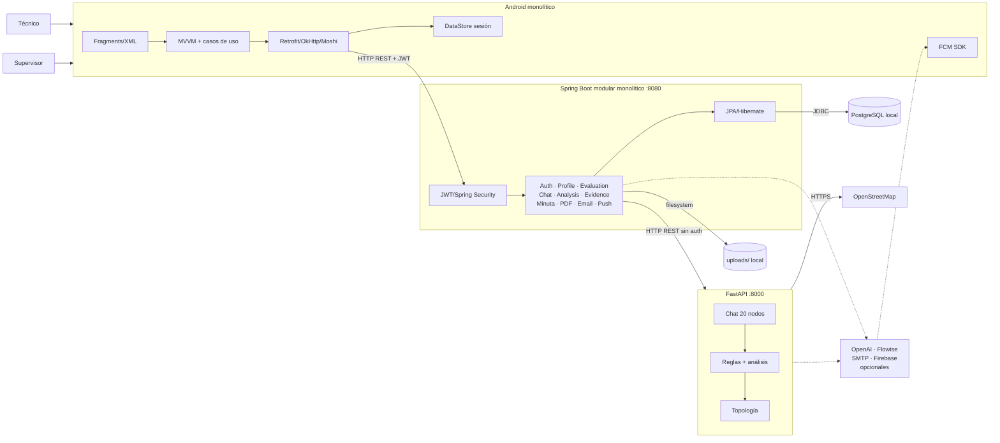

# Arquitectura actual — AS-IS

## Diagrama consolidado

## Fortalezas — arquitectura correcta

- Android depende de un único backend y no accede directamente a base de datos ni proveedores externos.
- Separación Android en presentación, dominio y datos con interfaces de repositorio e inyección Hilt.
- Contratos DTO separados de modelos de dominio y serialización Moshi.
- Autenticación stateless, contraseñas BCrypt, JWT firmado y autorización de validación con `@PreAuthorize`.
- Recuperación de contraseña evita enumeración básica de correos y no devuelve el código en HTTP.
- PostgreSQL está centralizado detrás del gateway; FastAPI no compite como segunda fuente de verdad.
- Motor del chat y topología deterministas, con fallback cuando OpenAI o Flowise fallan.
- El análisis opcional falla explícitamente cuando faltan credenciales, sin simular éxito.
- Evidencias separan binarios de metadatos.
- Existen manejo global de excepciones, endpoints de salud y pruebas unitarias del servicio de minutas.

## Problemas críticos

### 🔴 Seguridad de transporte y configuración móvil

- La app usa una URL HTTP hardcodeada y permite cleartext globalmente. Los JWT, datos personales y evidencias podrían viajar sin cifrado fuera del entorno local.
- El logging OkHttp está en nivel `BODY` para todos los builds; aunque oculta `Authorization`, puede registrar credenciales, datos personales y payloads técnicos.
- La variante `release` no aplica minificación y no se observa configuración por ambiente.

### 🔴 Autorización por recurso insuficiente

- La mayoría de los endpoints exige JWT, pero `EvaluationController`, `HistoryController` y `EvidenceController` no validan propiedad del recurso ni rol.
- `Evaluation` no contiene un propietario visible. Un usuario autenticado podría enumerar, actualizar o borrar evaluaciones ajenas.
- El análisis de evidencia busca `evidenceId` sin comprobar que pertenezca al `evaluationId` de la URL.
- `/uploads/**` es público, por lo que fotografías técnicas quedan accesibles sin JWT si se conoce o descubre la URL.
- El registro acepta un rol proporcionado por el cliente mediante `Role.fromString`; debe comprobarse que un usuario no pueda autoasignarse `SUPERVISOR`.

### 🔴 Riesgo de pérdida y exposición de archivos

- Las evidencias viven en disco local sin almacenamiento redundante, versionado, cifrado documentado, antivirus ni política de retención.
- No se identificó validación fuerte de categoría, firma/magic bytes o tipo real de archivo en upload.
- No se identificaron backups ni recuperación ante desastres.

### 🔴 Controles de abuso de autenticación

- No se identificó rate limiting para login, registro o códigos de recuperación.
- Los códigos de recuperación se guardan aparentemente en texto claro y no se observó contador de intentos.
- No se identificaron refresh tokens, revocación de JWT ni rotación de claves.

## Mejoras recomendadas

### 🟠 Confiabilidad y performance

- `RestTemplate` no configura timeouts, retries, circuit breaker ni connection pooling explícito para FastAPI.
- Chat, análisis visual, SMTP y FCM se ejecutan dentro de peticiones síncronas; una dependencia lenta ocupa threads del gateway.
- Las imágenes se convierten completas a Base64 en memoria, aumentando aproximadamente un tercio el tamaño y presión de memoria.
- Varias listas usan `findAll()` sin paginación.
- JSON estructural de minuta se guarda como texto, reduciendo validación y capacidad de consulta.

### 🟠 Contratos y consistencia

- Android conserva rutas `/api/v1/...` no implementadas por el gateway.
- Existen dos conceptos de evidencia: una API avanzada legado `/api/v1` y el flujo real simplificado.
- `ProposalController` entrega mocks y convive con el flujo real `/api/proposals`.
- El PDF recibe su contenido desde Android, en vez de reconstruirlo desde datos autorizados del servidor.
- FastAPI recibe todo el mapa de respuestas en cada petición y no valida identidad/autorización de servicio.
- No hay versionado uniforme de la API ni contrato OpenAPI compartido/generado para Android.

### 🟠 Operación y entrega

- No se identificaron CI/CD, contenedores, migraciones Flyway/Liquibase, despliegues reproducibles ni pruebas end-to-end.
- Observabilidad limitada a logs estándar y `health/info`; no hay métricas, tracing, correlación o alertas.
- CORS usa `*` por defecto en gateway y FastAPI.
- No se identificó un gestor de secretos, perfiles por ambiente o rotación automatizada.
- `DataSeeder` inserta datos al arranque cuando la tabla está vacía; debería limitarse a un perfil de desarrollo.

## Evaluación por dimensión

| Dimensión | Estado | Observación |
|---|---|---|
| Seguridad | Crítico para producción | JWT/BCrypt correctos; TLS y autorización por recurso insuficientes |
| Escalabilidad | Desarrollo/MVP | Gateway y FastAPI escalables como procesos, pero disco local y estado/configuración bloquean horizontalidad |
| Performance | Aceptable para carga baja | Todo síncrono, sin paginación ni resiliencia de llamadas |
| Acoplamiento | Medio | Buen límite Gateway/FastAPI; Android depende de contratos inconsistentes |
| Separación | Buena base | Módulos claros; gateway combina API, negocio, archivos e integraciones |
| Errores | Parcial | Handler global y fallbacks; faltan políticas uniformes y resiliencia |
| Autenticación | Buena base | Stateless + BCrypt; faltan rate limits, refresh/revocación |
| Autorización | Débil | Rol aplicado a validación; ownership general no aplicado |
| Datos | Parcial | PostgreSQL central; relaciones lógicas y migraciones ausentes |
| Python | Bien delimitado | Sin persistencia activa; requiere auth interna y controles operativos |
| Externos | Degradación parcial | OpenAI/Flowise tienen fallback; SMTP/FCM son directos |
| Observabilidad | Insuficiente | Health/info y logs solamente |
| CI/CD | Ausente | No identificado en repositorios |

