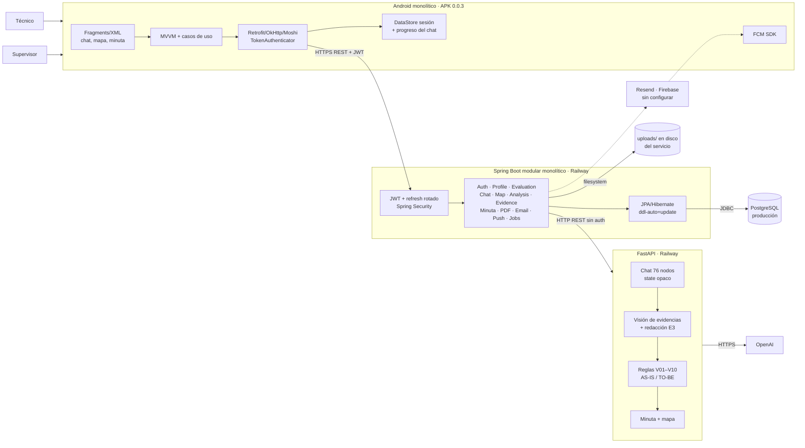

# Arquitectura actual — AS-IS

Actualizada al 6 de octubre de 2026, contra el código desplegado (APK 0.0.3). Los puntos marcados con ✅ estaban como problema en la revisión del 17 de agosto y ya se resolvieron.

## Diagrama consolidado

```mermaid
flowchart LR
    TECH[Técnico]
    SUP[Supervisor]

    subgraph APP[Android monolítico · APK 0.0.3]
        SCREEN[Fragments/XML<br/>chat, mapa, minuta]
        VM[MVVM + casos de uso]
        HTTP[Retrofit/OkHttp/Moshi<br/>TokenAuthenticator]
        DS[DataStore sesión<br/>+ progreso del chat]
        FCMAPP[FCM SDK]
        SCREEN --> VM --> HTTP
        HTTP --> DS
    end

    subgraph BACK[Spring Boot modular monolítico · Railway]
        SEC[JWT + refresh rotado<br/>Spring Security]
        MODULES[Auth · Profile · Evaluation<br/>Chat · Map · Analysis · Evidence<br/>Minuta · PDF · Email · Push · Jobs]
        JPA[JPA/Hibernate<br/>ddl-auto=update]
        SEC --> MODULES --> JPA
    end

    subgraph IA[FastAPI · Railway]
        CHAT[Chat 76 nodos<br/>state opaco]
        VIS[Visión de evidencias<br/>+ redacción E3]
        RULE[Reglas V01–V10<br/>AS-IS / TO-BE]
        DOC[Minuta + mapa]
        CHAT --> VIS --> RULE --> DOC
    end

    DB[(PostgreSQL<br/>producción)]
    FS[(uploads/ en disco<br/>del servicio)]
    OAI[OpenAI]
    OPT[Resend · Firebase<br/>sin configurar]

    TECH --> APP
    SUP --> APP
    HTTP -->|HTTPS REST + JWT| SEC
    MODULES -->|HTTP REST sin auth| IA
    JPA -->|JDBC| DB
    MODULES -->|filesystem| FS
    IA -->|HTTPS| OAI
    MODULES -.-> OPT
    OPT -.-> FCMAPP
```

## Fortalezas

- Android depende de un solo backend y no accede directo a la base ni a proveedores externos.
- Separación en Android por presentación, dominio y datos, con interfaces de repositorio e inyección Hilt.
- Contratos DTO separados de los modelos de dominio; serialización con Moshi.
- Autenticación stateless con BCrypt y JWT firmado. ✅ Ahora hay **refresh token rotado** (se guarda solo su hash) y **logout** que lo revoca.
- ✅ El **registro siempre crea Técnico**: el rol Supervisor solo se asigna por base de datos.
- La recuperación de contraseña evita la enumeración básica de correos y no devuelve el código en HTTP.
- PostgreSQL centralizado detrás del gateway: FastAPI no es una segunda fuente de verdad. El chat no guarda estado en el servidor (`state` opaco).
- ✅ **Las respuestas del chat se persisten** (`chat_answers_json`) y alimentan el análisis, la minuta y el mapa.
- ✅ **La minuta PDF se arma en el servidor** desde los datos persistidos, no desde contenido enviado por la app.
- Motor de reglas determinista (V01–V10, AS-IS/TO-BE) que funciona sin OpenAI. La visión falla de forma explícita si no hay clave.
- ✅ Credenciales de la etiqueta del router (E3) ocultas antes de guardar o mostrar.
- ✅ Transporte HTTPS en producción (Railway) y Dockerfiles por servicio.
- Manejo global de excepciones, endpoints de salud y pruebas (gateway: minutas, PDF, auth, anulación; FastAPI: motor de flujo, API del chat, muestra de Rock & Burgers, mapa).

## Problemas críticos

### 🔴 Despliegue sin red de seguridad

- Cada push a `main` despliega en producción. No hay ambiente de staging ni pruebas automáticas en el pipeline.
- `ddl-auto=update` en producción: una entidad nueva crea tablas en la base real, y los cambios de enums dan error por las restricciones existentes.
- El APK es un build **debug** sin llave de release.

### 🔴 Seguridad de la app móvil

- `usesCleartextTraffic="true"` sigue activo de forma global.
- El logging de OkHttp está en nivel `BODY` para todos los builds. Aunque oculta `Authorization`, puede registrar datos personales, respuestas del chat y fotos en Base64.
- `isMinifyEnabled = false` en release; no hay configuración por ambiente (la `BASE_URL` es una constante que se cambia a mano).

### 🔴 Autorización por recurso insuficiente

- `EvaluationController` y `HistoryController` no validan dueño ni rol. `GET /api/evaluations/{id}` devuelve cualquier evaluación a un usuario autenticado.
- `Evaluation` no tiene campo de propietario: un usuario podría enumerar, actualizar o borrar evaluaciones ajenas.
- `/uploads/**` es público: las fotos técnicas (routers, IPs, locales) son accesibles sin JWT si se conoce la URL.

### 🔴 Archivos de evidencia

- Están en el disco del servicio. ⚠️ Sin evidencia en el repo de un volumen persistente en Railway: si no lo hay, las fotos se pierden en cada redeploy, y las minutas viejas no podrían regenerar el PDF.
- No hay redundancia, versionado, cifrado documentado ni política de retención.

### 🔴 Controles de abuso de autenticación

- No se identificó rate limiting en login, registro ni códigos de recuperación.
- El código de recuperación se guarda en texto claro (`users.reset_code`), sin contador de intentos.

## Mejoras recomendadas

### 🟠 Confiabilidad y performance

- `RestTemplate` sin timeouts, retries ni circuit breaker hacia FastAPI. El chat con visión hace llamadas síncronas a OpenAI dentro de la petición.
- Las fotos viajan en Base64 dentro del JSON (cerca de un tercio más pesadas) y el `state` crece con cada evidencia.
- Varias listas usan `findAll()` o `findActive()` sin paginación.
- JSON guardado como `TEXT` (`chat_answers_json`, `map_json`, `content_json`, `extracted_json`): no se valida ni se puede consultar.

### 🟠 Contratos y consistencia

- Conviven el checklist de evidencias (`/api/v1/...`) y las evidencias del chat. El checklist ya no se usa en el flujo principal.
- `ProposalController` sigue entregando contenido de prueba (mock).
- `/api/proposals/pdf` (propuesta legada) todavía recibe el contenido desde Android.
- FastAPI no valida la identidad del gateway (sin autenticación de servicio). Además conserva el motor legado de 23 nodos y la geocodificación.
- No hay contrato OpenAPI compartido ni versionado uniforme de la API.

### 🟠 Operación y entrega

- No hay migraciones versionadas (Flyway/Liquibase), staging, pruebas end-to-end ni pruebas automáticas antes del deploy.
- Observabilidad limitada a logs y `health/info`: sin métricas, tracing ni alertas.
- CORS `*` por defecto en el gateway y en FastAPI.
- `DataSeeder` inserta datos al arrancar si la tabla está vacía; debería limitarse a un perfil de desarrollo.
- La base de conocimiento de minutas manuales (`kb_*`) está diseñada pero no implementada. Debe probarse solo en local (ver `../base-conocimiento/`).

## Evaluación por dimensión

| Dimensión | Estado | Observación |
|---|---|---|
| Seguridad | Crítico para escalar | ✅ HTTPS, refresh rotado y registro como Técnico. 🔴 Sin control de dueño, `/uploads` público y logging BODY |
| Escalabilidad | MVP en producción | Gateway y FastAPI son contenedores, pero el disco local y la ausencia de colas limitan escalar horizontalmente |
| Performance | Aceptable con carga baja | Visión síncrona dentro del chat, sin timeouts ni paginación |
| Acoplamiento | Medio | Buen límite Gateway/FastAPI. APK y backend deben desplegarse juntos |
| Separación | Buena base | Módulos claros; el gateway combina API, negocio, archivos e integraciones |
| Errores | Parcial | Handler global y errores explícitos (E9 obligatoria, correo apagado); faltan políticas de resiliencia |
| Autenticación | Buena | ✅ Stateless, BCrypt, refresh rotado y logout. Faltan rate limits y hash del código de recuperación |
| Autorización | Débil | Rol aplicado a validar minutas; dueño de la evaluación no aplicado |
| Datos | Parcial | PostgreSQL central y respuestas persistidas; sin migraciones ni relaciones JPA |
| Python | Bien delimitado | Sin persistencia; requiere auth de servicio y retirar el motor legado |
| Externos | Degradación parcial | OpenAI con fallback por reglas; Resend y FCM apagados explícitamente |
| Observabilidad | Insuficiente | Health/info y logs |
| CI/CD | Riesgoso | Auto-deploy desde `main` sin pruebas ni staging |
