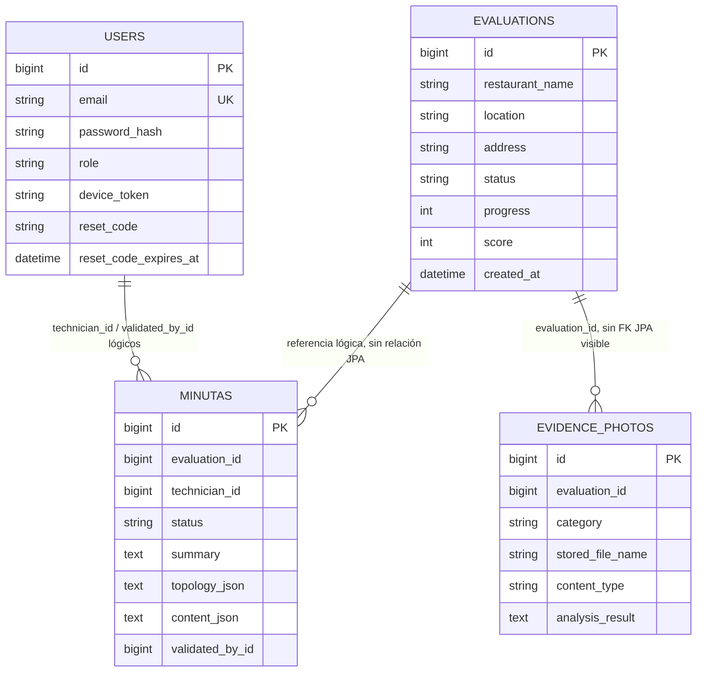

# Arquitectura técnica detallada

## Diagrama 2 — Componentes, módulos y dependencias

```mermaid
flowchart TB
    subgraph MOBILE[Android — AsistenteRedIDBI]
        UI[Fragments + XML + Navigation<br/>auth, home, chat, evidencia,<br/>minutas, perfil, historial]
        STATE[ViewModels + LiveData<br/>Coroutines]
        DOMAIN[Use cases + modelos<br/>interfaces de repositorio]
        DATA[Repositorios + mappers + DTO]
        NET[Retrofit + OkHttp + Moshi<br/>logging BODY + Bearer JWT]
        SESSION[DataStore Preferences<br/>token, expiración, rol,<br/>userId, fullName]
        MEDIA[Camera/gallery URI + Glide<br/>FileProvider + utilidades PDF]
        PUSHCLIENT[Firebase Messaging SDK]
        GRAPH[TopologyGraphView<br/>renderizado local]

        UI --> STATE --> DOMAIN --> DATA --> NET
        NET --> SESSION
        UI --> MEDIA
        UI --> GRAPH
        PUSHCLIENT --> UI
    end

    subgraph GW[Spring Boot — idbi-api-gateway]
        FILTER[Spring Security<br/>JwtAuthFilter + CORS<br/>stateless]
        AUTH[Auth<br/>registro, login,<br/>recovery/reset]
        PROFILE[Profile<br/>datos y estadísticas]
        EVAL[Evaluations + History<br/>CRUD y estado]
        CHAT[Chat proxy<br/>start / answer]
        ANALYSIS[Analysis proxy<br/>reglas derivadas del chat]
        EVIDENCE[Evidence<br/>multipart, metadata, análisis]
        MINUTA[Minutas<br/>borrador, completa, validada]
        PROPOSAL[Proposal legado<br/>respuesta hardcodeada/no activa]
        PDF[PDFBox<br/>generación en memoria]
        EMAIL[JavaMail<br/>recovery y PDF adjunto]
        NOTIFY[Device tokens +<br/>Firebase Admin]
        ERROR[GlobalExceptionHandler]
        ORM[Spring Data JPA / Hibernate]
        STATIC[Resource handler<br/>/uploads/** público]

        FILTER --> AUTH
        FILTER --> PROFILE
        FILTER --> EVAL
        FILTER --> CHAT
        FILTER --> ANALYSIS
        FILTER --> EVIDENCE
        FILTER --> MINUTA
        FILTER --> PDF
        FILTER --> NOTIFY
        AUTH --> ORM
        PROFILE --> ORM
        EVAL --> ORM
        EVIDENCE --> ORM
        MINUTA --> ORM
        NOTIFY --> ORM
        AUTH --> EMAIL
        PDF --> EMAIL
        EVIDENCE --> STATIC
        ERROR -. captura excepciones .-> AUTH
    end

    subgraph PY[Python — idbi-fastapi]
        ROUTES[FastAPI routes<br/>/chat, /analyze,<br/>/analyze-photo, /health]
        ENGINE[ChatEngine<br/>grafo de 20 nodos]
        RULES[Reglas deterministas<br/>propuesta + score]
        TOPO[Constructor de topología]
        ANALYTICS[Análisis de cuatro áreas]
        GEO[Geocodificación]
        VISION[Análisis de imagen]
        LLM[Adaptadores opcionales<br/>OpenAI / Flowise<br/>fallback a reglas]
        LEGACY[Paquetes vacíos legado<br/>database/models/routers/<br/>schemas/services]

        ROUTES --> ENGINE
        ROUTES --> ANALYTICS
        ROUTES --> VISION
        ENGINE --> RULES --> TOPO
        ENGINE --> GEO
        ENGINE -.-> LLM
        VISION -.-> LLM
    end

    PG[(PostgreSQL<br/>users, evaluations,<br/>minutas, evidence_photos)]
    UPLOADS[(uploads/evidence/{evaluationId}<br/>archivos locales)]
    OSM[Nominatim]
    OAI[OpenAI API]
    FLOW[Flowise configurable]
    SMTP[SMTP configurable]
    FCM[Firebase Cloud Messaging]

    NET -->|HTTP REST, JSON/multipart<br/>JWT; base URL hardcodeada| FILTER
    CHAT -->|POST /chat/start y /answer<br/>JSON síncrono| ROUTES
    ANALYSIS -->|POST /analyze<br/>JSON síncrono| ROUTES
    EVIDENCE -->|POST /analyze-photo<br/>imagen Base64 síncrona| ROUTES
    ORM -->|JDBC / SQL| PG
    EVIDENCE -->|Java NIO| UPLOADS
    STATIC -->|HTTP GET sin JWT| NET
    GEO -->|HTTPS GET + User-Agent| OSM
    LLM -.->|HTTPS API| OAI
    LLM -.->|HTTP/HTTPS REST| FLOW
    EMAIL -.->|SMTP STARTTLS| SMTP
    NOTIFY -.->|Firebase Admin HTTPS| FCM
    FCM -.->|push asíncrono| PUSHCLIENT
```

## Contratos HTTP activos

### Android → Gateway

| Área | Rutas principales | Datos | Autenticación |
|---|---|---|---|
| Auth | `/api/auth/register`, `/login`, `/forgot-password`, `/reset-password` | JSON de usuario/credenciales/código | Públicas |
| Perfil | `GET /api/profile/me` | Perfil, estadísticas y recientes | Bearer JWT |
| Evaluación | `POST /api/evaluations`, `GET /api/evaluations/{id}` | Identidad y estado de evaluación | Bearer JWT |
| Chat | `/api/evaluations/{id}/chat/start`, `/answer` | Paso, respuesta y mapa acumulado | Bearer JWT |
| Análisis | `POST /api/evaluations/{id}/analysis` | Respuestas del chat | Bearer JWT |
| Evidencias | `GET/POST /api/evaluations/{id}/evidence...` | Multipart y metadata JSON | Bearer JWT |
| Minutas | `/api/minutas...` | Contenido, topología y transiciones de estado | Bearer JWT; validar exige supervisor |
| PDF | `/api/proposals/pdf`, `/send` | Datos de propuesta; PDF binario | Bearer JWT |
| Notificación | `PUT /api/notifications/device-token` | Token FCM | Bearer JWT |

### Gateway → FastAPI

| Consumidor | Endpoint FastAPI | Contenido | Naturaleza |
|---|---|---|---|
| `ChatService` | `POST /chat/start` | `evaluationId` | HTTP síncrono, sin auth de servicio |
| `ChatService` | `POST /chat/answer` | paso, respuesta y mapa completo | HTTP síncrono, sin auth de servicio |
| `AnalysisService` | `POST /analyze` | ID, establecimiento y respuestas | HTTP síncrono, sin auth de servicio |
| `EvidencePhotoAnalysisService` | `POST /analyze-photo` | categoría e imagen Base64 | HTTP síncrono, sin auth de servicio |

## Modelo de datos observado



No se observaron asociaciones JPA explícitas entre estas entidades; se almacenan identificadores escalares. Tampoco se encontró evidencia en las entidades de que `Evaluation` pertenezca a un usuario.

## Código presente fuera del flujo activo

- Android conserva interfaces `/api/v1/...` para checklist avanzado de evidencia, marca de perfil y `auth/me`; el gateway actual no implementa esas rutas y los comentarios indican que varias no se invocan desde pantallas activas.
- `ProposalController` del gateway devuelve contenido hardcodeado y no forma parte del flujo real de PDF/minuta.
- FastAPI conserva archivos vacíos bajo `database`, `models`, `routers`, `schemas` y `services`; el `main.py` no los registra.
- Room, iText y ML Kit están declarados en Android, pero no se encontró una base Room activa ni un flujo principal que dependa de ellos. El PDF real se genera con PDFBox en el gateway.

## Configuración y secretos

- Gateway: `DB_*`, `JWT_*`, `FASTAPI_BASE_URL`, `FIREBASE_CREDENTIALS_PATH`, `MAIL_*`, `CORS_ALLOWED_ORIGINS`, `UPLOADS_DIR`, `JPA_*`.
- FastAPI: `CHAT_PROPOSAL_ENGINE`, `CHAT_HTTP_TIMEOUT`, `FLOWISE_*`, `OPENAI_*`; el `.env.example` contiene variables futuras de DB/JWT no usadas por el `main.py` activo.
- Android: base URL hardcodeada a `http://10.0.2.2:8080/`; Firebase se activa condicionalmente cuando existe `app/google-services.json`.

⚠️ No se pudo determinar desde el código cómo se gestionarán secretos, rotación de claves o configuración por ambiente en producción.
