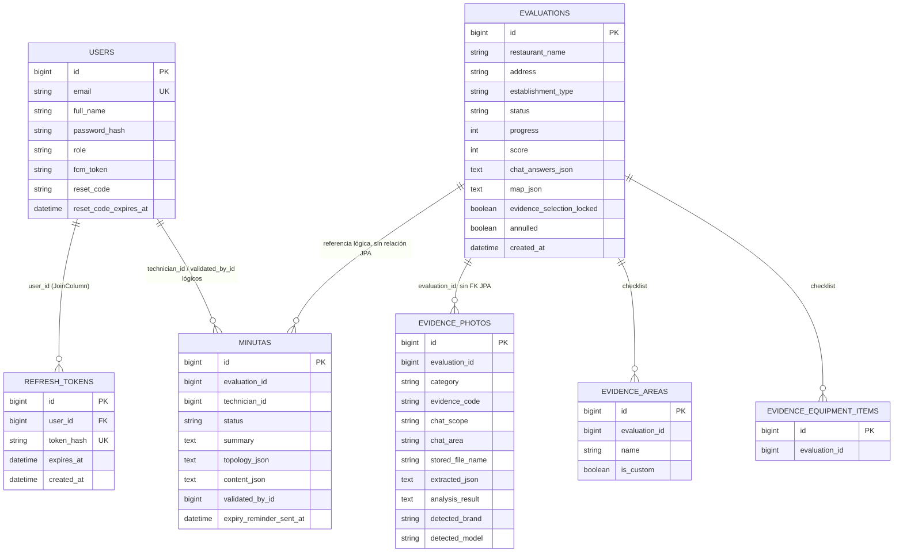

# Arquitectura técnica detallada

Actualizada al 6 de octubre de 2026, contra los commits Android `089040f`, gateway `c81c257` y FastAPI `dd03113`.

## Diagrama 2 — Componentes, módulos y dependencias

```mermaid
flowchart TB
    subgraph MOBILE[Android — AsistenteRedIDBI 0.0.2]
        UI[Fragments + XML + Navigation<br/>auth, home, chat técnico,<br/>mapa editable, minuta, perfil, historial]
        STATE[ViewModels + LiveData<br/>Coroutines]
        DOMAIN[Use cases + modelos<br/>interfaces de repositorio]
        DATA[Repositorios + mappers + DTO]
        NET[Retrofit + OkHttp + Moshi<br/>logging BODY + Bearer JWT<br/>TokenAuthenticator: refresh]
        SESSION[DataStore Preferences<br/>access y refresh token, rol,<br/>userId, fullName]
        PROGRESS[ChatProgressStore<br/>estado opaco del chat<br/>para Continuar]
        MEDIA[Galería/cámara + Glide<br/>FileProvider]
        PUSHCLIENT[Firebase Messaging SDK]
        GRAPH[MapCanvasView: mapa editable<br/>TopologyGraphView: vista]

        UI --> STATE --> DOMAIN --> DATA --> NET
        NET --> SESSION
        STATE --> PROGRESS
        UI --> MEDIA
        UI --> GRAPH
        PUSHCLIENT --> UI
    end

    subgraph GW[Spring Boot — AsistenteRedIDBI-API-Gateway]
        FILTER[Spring Security<br/>JwtAuthFilter + CORS<br/>stateless]
        AUTH[Auth<br/>registro siempre TECNICO,<br/>login, refresh rotado, logout,<br/>recovery/reset]
        PROFILE[Profile<br/>datos y estadísticas]
        EVAL[Evaluations + History<br/>CRUD, anular borrador,<br/>chat_answers_json, map_json]
        CHAT[Chat proxy<br/>start / answer / answer-photos / amend]
        MAP[Map<br/>generate / command / guardar]
        ANALYSIS[Analysis proxy<br/>AS-IS / TO-BE]
        EVIDENCE[Evidence<br/>fotos del chat + checklist<br/>evidence_code, extracted_json]
        MINUTA[Minutas<br/>borrador, completa, validada<br/>+ recordatorio programado]
        MPDF[Minuta PDF<br/>Thymeleaf + OpenHTMLtoPDF]
        PDF[Propuesta PDF<br/>PDFBox]
        PROPOSAL[Proposal legado<br/>hardcodeado, no activo]
        EMAIL[EmailService<br/>Resend API]
        NOTIFY[Device tokens +<br/>Firebase Admin]
        RUC[RucValidationService<br/>apagado por defecto]
        ERROR[GlobalExceptionHandler]
        ORM[Spring Data JPA / Hibernate<br/>ddl-auto=update]
        STATIC[Resource handler<br/>/uploads/** público]

        FILTER --> AUTH
        FILTER --> PROFILE
        FILTER --> EVAL
        FILTER --> CHAT
        FILTER --> MAP
        FILTER --> ANALYSIS
        FILTER --> MINUTA
        FILTER --> MPDF
        FILTER --> PDF
        FILTER --> NOTIFY
        CHAT --> EVIDENCE
        EVAL --> RUC
        AUTH --> ORM
        PROFILE --> ORM
        EVAL --> ORM
        EVIDENCE --> ORM
        MINUTA --> ORM
        NOTIFY --> ORM
        AUTH --> EMAIL
        PDF --> EMAIL
        MPDF --> EMAIL
        EVIDENCE --> STATIC
        ERROR -. captura excepciones .-> AUTH
    end

    subgraph PY[Python — AsistenteRedIDBI-API]
        ROUTES[FastAPI routes<br/>/chat/*, /analyze,<br/>/analyze-photo, /evidence-checklist/seed]
        FLOWENG[flow_engine.py<br/>76 nodos desde<br/>flujo_asistente_red.json]
        EVID[evidence.py<br/>visión + redacción E3]
        CHECKS[checks.py<br/>reglas V01–V10]
        PROP[proposal.py<br/>AS-IS / TO-BE + score]
        MINDOC[minuta_doc.py<br/>documento de minuta]
        MAPMOD[map_model.py + map_render.py<br/>mapa JSON y PNG]
        LEGACY[legacy_adapter.py<br/>claves del chat viejo]
        OLDENG[engine.py + geocoding<br/>motor legado de 23 nodos]
        LLM[Adaptadores opcionales<br/>OpenAI / Flowise]

        ROUTES --> FLOWENG
        FLOWENG --> EVID --> CHECKS
        FLOWENG --> LEGACY --> PROP
        ROUTES --> MINDOC
        MINDOC --> CHECKS
        ROUTES --> MAPMOD
        ROUTES --> PROP
        EVID -.-> LLM
        PROP -.-> LLM
    end

    PG[(PostgreSQL<br/>users, refresh_tokens, evaluations,<br/>minutas, evidence_photos,<br/>evidence_areas, evidence_equipment_items)]
    UPLOADS[(uploads/evidence/evaluationId<br/>disco del servicio)]
    OAI[OpenAI API]
    RESEND[Resend API]
    FCM[Firebase Cloud Messaging]

    NET -->|HTTPS REST, JSON/multipart<br/>JWT; BASE_URL Railway| FILTER
    CHAT -->|POST /chat/start, /answer, /amend<br/>state opaco + fotos Base64| ROUTES
    MAP -->|POST /chat/map/generate, /command| ROUTES
    MPDF -->|POST /chat/minuta-document| ROUTES
    ANALYSIS -->|POST /analyze| ROUTES
    EVIDENCE -->|POST /analyze-photo<br/>POST /evidence-checklist/seed| ROUTES
    ORM -->|JDBC / SQL| PG
    EVIDENCE -->|Java NIO| UPLOADS
    STATIC -->|HTTP GET sin JWT| NET
    LLM -.->|HTTPS API| OAI
    EMAIL -.->|HTTPS| RESEND
    NOTIFY -.->|Firebase Admin HTTPS| FCM
    FCM -.->|push asíncrono| PUSHCLIENT
```

## Contratos HTTP activos

La lista completa de endpoints está en [`../analista-ia/04_Backend_APIs.md`](../analista-ia/04_Backend_APIs.md).

### Android → Gateway

| Área | Rutas principales | Datos | Autenticación |
|---|---|---|---|
| Auth | `/api/auth/register`, `/login`, `/refresh`, `/logout`, `/forgot-password`, `/reset-password` | Credenciales, refresh token, código | Públicas |
| Perfil | `GET /api/profile/me` | Perfil, estadísticas y recientes | Bearer JWT |
| Evaluación | `/api/evaluations` (CRUD), `POST /{id}/anular`, `/api/history` | Identidad y estado de la evaluación | Bearer JWT |
| Chat | `/api/evaluations/{id}/chat/start`, `/answer`, `/answer-photos` (multipart), `/amend` | `state` opaco + respuesta o fotos (1 a 3) | Bearer JWT |
| Mapa | `/api/evaluations/{id}/map` (GET/PUT), `/generate`, `/command` | Mapa JSON editable | Bearer JWT |
| Análisis | `/api/evaluations/{id}/analysis` | Respuestas persistidas | Bearer JWT |
| Minuta PDF | `GET /api/evaluations/{id}/minuta/pdf`, `POST .../send` | PDF armado **en el servidor** | Bearer JWT |
| Minutas | `/api/minutas...` | Contenido, topología y transiciones | Bearer JWT; validar exige Supervisor |
| Propuesta PDF | `/api/proposals/pdf`, `/send` | Contenido enviado desde Android | Bearer JWT |
| Notificación | `PUT /api/notifications/device-token` | Token FCM | Bearer JWT |

### Gateway → FastAPI

| Consumidor | Endpoint FastAPI | Contenido | Naturaleza |
|---|---|---|---|
| `ChatService` | `POST /chat/start`, `/chat/answer`, `/chat/amend` | `evaluationId`, `state`, respuesta, fotos Base64 | HTTP síncrono, sin auth de servicio |
| `MapService` | `POST /chat/map/generate`, `/chat/map/command` | `state` y comando | HTTP síncrono, sin auth de servicio |
| `MinutaPdfService` | `POST /chat/minuta-document` | `state` | HTTP síncrono, sin auth de servicio |
| `AnalysisService` | `POST /analyze` | Respuestas y equipos detectados | HTTP síncrono, sin auth de servicio |
| `EvidencePhotoAnalysisService` | `POST /analyze-photo` | Categoría e imagen Base64 | HTTP síncrono, sin auth de servicio |
| `EvidenceChecklistService` | `POST /evidence-checklist/seed`, `GET /chat/nodes` | Respuestas del chat | HTTP síncrono, sin auth de servicio |

## Modelo de datos observado

```mermaid
erDiagram
    USERS {
        bigint id PK
        string email UK
        string full_name
        string password_hash
        string role
        string fcm_token
        string reset_code
        datetime reset_code_expires_at
    }
    REFRESH_TOKENS {
        bigint id PK
        bigint user_id FK
        string token_hash UK
        datetime expires_at
        datetime created_at
    }
    EVALUATIONS {
        bigint id PK
        string restaurant_name
        string address
        string establishment_type
        string status
        int progress
        int score
        text chat_answers_json
        text map_json
        boolean evidence_selection_locked
        boolean annulled
        datetime created_at
    }
    MINUTAS {
        bigint id PK
        bigint evaluation_id
        bigint technician_id
        string status
        text summary
        text topology_json
        text content_json
        bigint validated_by_id
        datetime expiry_reminder_sent_at
    }
    EVIDENCE_PHOTOS {
        bigint id PK
        bigint evaluation_id
        string category
        string evidence_code
        string chat_scope
        string chat_area
        string stored_file_name
        text extracted_json
        text analysis_result
        string detected_brand
        string detected_model
    }
    EVIDENCE_AREAS {
        bigint id PK
        bigint evaluation_id
        string name
        boolean is_custom
    }
    EVIDENCE_EQUIPMENT_ITEMS {
        bigint id PK
        bigint evaluation_id
    }

    USERS ||--o{ REFRESH_TOKENS : "user_id (JoinColumn)"
    EVALUATIONS ||--o{ MINUTAS : "referencia lógica, sin relación JPA"
    EVALUATIONS ||--o{ EVIDENCE_PHOTOS : "evaluation_id, sin FK JPA"
    EVALUATIONS ||--o{ EVIDENCE_AREAS : "checklist"
    EVALUATIONS ||--o{ EVIDENCE_EQUIPMENT_ITEMS : "checklist"
    USERS ||--o{ MINUTAS : "technician_id / validated_by_id lógicos"
```

Notas:
- Se guardan identificadores escalares, sin asociaciones JPA explícitas. La única excepción es `refresh_tokens.user_id`, que sí es `@JoinColumn`.
- `Evaluation` **sigue sin un campo de propietario**. El dueño solo aparece en `minutas.technician_id`.
- **Propuesto, solo local:** tablas `kb_*` para la base de conocimiento de minutas manuales. Ver [`../base-conocimiento/BASE_CONOCIMIENTO_MINUTAS.md`](../base-conocimiento/BASE_CONOCIMIENTO_MINUTAS.md).

## Código presente fuera del flujo activo

- **Gateway, `ProposalController`:** devuelve contenido hardcodeado y no forma parte del flujo real.
- **Gateway, checklist de evidencias** (`/api/v1/evaluations/{id}/evidence/...`): sigue existiendo. Desde el chat de 76 nodos, la app va directo a la minuta y se salta ese checklist.
- **FastAPI, `engine.py` + `geocoding.py`:** motor legado de 23 nodos con geocodificación Nominatim. El flujo activo usa `flow_engine.py`.
- **FastAPI, carpetas `database/`, `models/`, `routers/`, `schemas/`, `services/`:** existen, pero el servicio no tiene base propia.
- **Android:**
  - Room, iText y ML Kit siguen declarados en Gradle sin un uso principal.
  - El PDF real se genera en el gateway.

## Configuración y secretos

- **Gateway:**
  - Base y seguridad: `DB_URL`, `DB_USERNAME`, `DB_PASSWORD`, `JWT_SECRET`, `JWT_EXPIRATION_MINUTES`, `JWT_REFRESH_EXPIRATION_DAYS`.
  - Integraciones: `FASTAPI_BASE_URL`, `FIREBASE_CREDENTIALS_JSON` o `FIREBASE_CREDENTIALS_PATH`, `MAIL_ENABLED`, `RESEND_API_KEY`, `MAIL_FROM`, `RUC_VALIDATION_ENABLED`, `RUC_VALIDATION_API_KEY`.
  - Operación: `CORS_ALLOWED_ORIGINS`, `UPLOADS_DIR`, `JPA_DDL_AUTO`, `JPA_SHOW_SQL`, `SERVER_PORT`, `DRAFT_TTL_DAYS`, `DRAFT_WARN_DAYS_BEFORE`, `REMINDERS_CRON`.
- **FastAPI:** `OPENAI_API_KEY`, `OPENAI_MODEL`, `CHAT_PROPOSAL_ENGINE`, `CHAT_HTTP_TIMEOUT`, `FLOWISE_*`. El `.env.example` todavía lista `DATABASE_URL` y JWT, que no se usan.
- **Android:**
  - `BASE_URL` compilada como `https://asistenteredidbi.up.railway.app/` en `AuthModule.kt`. Para probar en local se cambia a mano a `10.0.2.2:8080`, y hay que revertirlo antes de cualquier commit.
  - Firebase se activa solo cuando existe `app/google-services.json`.
- **Producción:** los secretos viven en las variables de entorno de Railway.
  - ⚠️ El código no permite saber si existe rotación de claves.
