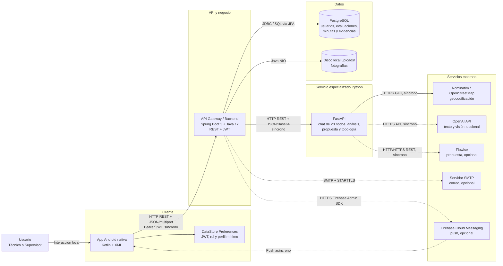

# Arquitectura general

## Diagrama 1 — Vista para stakeholders

## Límites del sistema

### Clientes encontrados

- Android nativo: identificado e implementado.
- iOS: **No identificado en el repositorio**.
- Flutter o React Native: **No identificado en el repositorio**.
- Frontend web o portal de administración: **No identificado en el repositorio**.
- Otros clientes: Swagger/OpenAPI generado por FastAPI sirve para exploración técnica, no se identificó como producto de usuario.

### Estilo arquitectónico

- App Android con MVVM y separación `presentation` / `domain` / `data`.
- Backend Spring Boot modular monolítico; el nombre “gateway” describe su papel, pero también contiene la lógica de negocio y persistencia.
- Servicio Python separado para lógica conversacional, reglas de análisis, topología e integraciones IA/geocodificación.
- Comunicación entre procesos principalmente síncrona por REST.
- PostgreSQL como fuente de verdad del negocio.
- Archivos de evidencia en disco local; la base conserva metadatos y resultado del análisis.

## Componentes principales

| Componente | Tecnología | Responsabilidad | Se comunica con | Protocolo |
|---|---|---|---|---|
| Usuario técnico/supervisor | Persona + dispositivo Android | Captura evaluación, evidencias y gestiona minutas | App Android | Interacción UI |
| App Android | Kotlin, Android SDK 35, XML, Navigation | UI móvil y coordinación del flujo | Gateway, DataStore, FCM | HTTP REST; almacenamiento local; push |
| UI y estado Android | Fragments, ViewModel, LiveData, Coroutines | Presentación y estado por pantalla | Casos de uso/repositorios | Llamadas en proceso |
| Networking Android | Retrofit, OkHttp, Moshi | Serialización y consumo del gateway | Gateway | HTTP REST + JSON/multipart + JWT |
| Sesión local | Jetpack DataStore Preferences | Guarda JWT, duración, rol, ID y nombre | Interceptor/UI | Acceso local |
| Gateway | Spring Boot 3.5.16, Java 17 | Seguridad y lógica de negocio | Android, PostgreSQL, FastAPI, SMTP, FCM, disco | REST, JDBC, HTTP, SMTP, HTTPS, filesystem |
| Seguridad | Spring Security, JJWT, BCrypt | Login, JWT stateless y rol supervisor | Usuarios y controladores | Bearer JWT / HS256 |
| Persistencia | Spring Data JPA, Hibernate | Usuarios, evaluaciones, minutas y evidencia | PostgreSQL | JDBC/SQL |
| FastAPI | Python, FastAPI, Pydantic | Chat, análisis, propuesta y topología | Gateway, OSM, OpenAI, Flowise | HTTP REST/JSON |
| PostgreSQL | PostgreSQL | Persistencia principal de negocio | Gateway | JDBC/SQL |
| Evidencias | Filesystem local `uploads/` | Guarda imágenes binarias | Gateway | Java NIO / HTTP estático |
| OpenStreetMap | Nominatim | Convierte nombre/dirección a coordenadas | FastAPI | HTTPS GET |
| OpenAI | OpenAI API | Resumen opcional y análisis visual | FastAPI | HTTPS API |
| Flowise | API REST configurable | Resumen alternativo de propuesta | FastAPI | HTTP/HTTPS REST + Bearer opcional |
| SMTP | Servidor configurable | Recuperación de contraseña y propuesta adjunta | Gateway | SMTP + STARTTLS |
| Firebase | FCM + Admin SDK | Envío y entrega de push | Gateway y Android | HTTPS + push asíncrono |
| Actuator | Spring Boot Actuator | Endpoints `health` e `info` | Operador local | HTTP |

## Componentes no identificados

| Capacidad | Estado observado |
|---|---|
| Caché/Redis | No identificado en el repositorio |
| Cola o broker de mensajes | No identificado en el repositorio |
| WebSockets/SSE/gRPC/GraphQL | No identificado en el repositorio |
| Jobs programados o batch | No identificado; existe un `CommandLineRunner` de datos iniciales |
| Analytics de producto | No identificado en el repositorio |
| APM, tracing o métricas centralizadas | No identificado; solo logging estándar y Actuator health/info |
| Docker/Kubernetes | No identificado en los tres repositorios |
| CI/CD | No identificado en los tres repositorios |
| Hosting/cloud/load balancer | No identificado en los tres repositorios |
| Secret manager | No identificado; se usan variables de entorno y archivos locales ignorados por Git |

