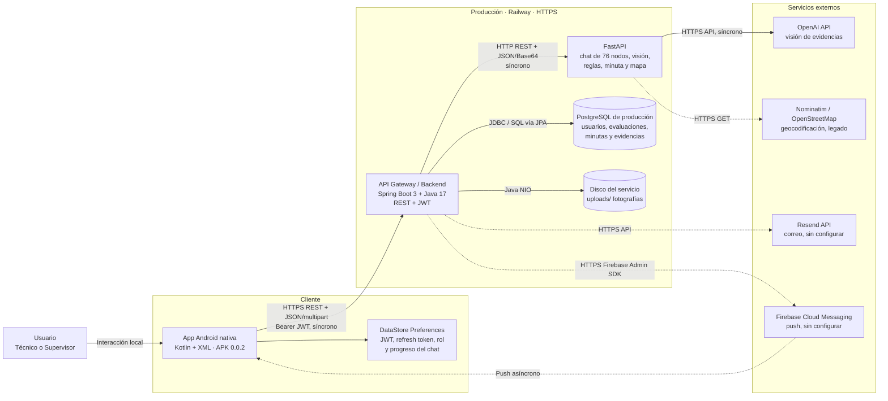

# Arquitectura general

Actualizada al 6 de octubre de 2026.

## Diagrama 1 — Vista para stakeholders

```mermaid
flowchart LR
    USER[Usuario<br/>Técnico o Supervisor]

    subgraph CLIENT[Cliente]
        ANDROID[App Android nativa<br/>Kotlin + XML · APK 0.0.2]
        LOCAL[DataStore Preferences<br/>JWT, refresh token, rol<br/>y progreso del chat]
        ANDROID --> LOCAL
    end

    subgraph RAILWAY[Producción · Railway · HTTPS]
        GATEWAY[API Gateway / Backend<br/>Spring Boot 3 + Java 17<br/>REST + JWT]
        FASTAPI[FastAPI<br/>chat de 76 nodos, visión,<br/>reglas, minuta y mapa]
        PG[(PostgreSQL de producción<br/>usuarios, evaluaciones,<br/>minutas y evidencias)]
        FILES[(Disco del servicio<br/>uploads/ fotografías)]
    end

    subgraph EXT[Servicios externos]
        OPENAI[OpenAI API<br/>visión de evidencias]
        OSM[Nominatim / OpenStreetMap<br/>geocodificación, legado]
        SMTP[Resend API<br/>correo, sin configurar]
        FCM[Firebase Cloud Messaging<br/>push, sin configurar]
    end

    USER -->|Interacción local| ANDROID
    ANDROID -->|HTTPS REST + JSON/multipart<br/>Bearer JWT, síncrono| GATEWAY
    GATEWAY -->|HTTP REST + JSON/Base64<br/>síncrono| FASTAPI
    GATEWAY -->|JDBC / SQL vía JPA| PG
    GATEWAY -->|Java NIO| FILES
    FASTAPI -->|HTTPS API, síncrono| OPENAI
    FASTAPI -.->|HTTPS GET| OSM
    GATEWAY -.->|HTTPS API| SMTP
    GATEWAY -.->|HTTPS Firebase Admin SDK| FCM
    FCM -.->|Push asíncrono| ANDROID
```

## Límites del sistema

### Clientes encontrados

- Android nativo: implementado (APK 0.0.2 de debug; no hay llave de release).
- iOS, Flutter, React Native, frontend web o portal de administración: **no identificados en los repositorios**.
- Swagger/OpenAPI generado por FastAPI: sirve para exploración técnica, no es un producto de usuario.

### Estilo arquitectónico

- App Android con MVVM y separación `presentation` / `domain` / `data`, con inyección Hilt.
- Backend Spring Boot modular monolítico. El nombre "gateway" describe su papel, pero también contiene la lógica de negocio y la persistencia.
- Servicio Python separado para:
  - el motor del chat (`flow_engine.py`, sin estado en el servidor: el cliente envía un `state` opaco);
  - la lectura de evidencias con IA;
  - las reglas de validación, la propuesta AS-IS/TO-BE, el documento de minuta y el mapa.
- Comunicación entre procesos síncrona por REST.
- PostgreSQL como fuente de verdad del negocio. Las respuestas del chat se guardan en `evaluations.chat_answers_json` y el mapa en `evaluations.map_json`.
- Archivos de evidencia en el disco del servicio del gateway. La base guarda metadatos, código de evidencia y resultado del análisis.

## Componentes principales

| Componente | Tecnología | Responsabilidad | Se comunica con | Protocolo |
|---|---|---|---|---|
| Usuario técnico o supervisor | Persona + dispositivo Android | Captura la evaluación y las evidencias en el chat; gestiona minutas | App Android | Interacción UI |
| App Android | Kotlin, Android SDK 35, XML, Navigation | UI móvil: chat, mapa editable, minuta, historial | Gateway, DataStore, FCM | HTTPS REST, almacenamiento local, push |
| UI y estado Android | Fragments, ViewModel, LiveData, Coroutines | Presentación y estado por pantalla. `ChatProgressStore` permite retomar el chat | Casos de uso y repositorios | Llamadas en proceso |
| Networking Android | Retrofit, OkHttp, Moshi | Serialización y consumo del gateway | Gateway | HTTPS REST + JSON/multipart + JWT |
| Gateway | Spring Boot 3.5, Java 17 | Seguridad, negocio, PDF (PDFBox para la propuesta; Thymeleaf + OpenHTMLtoPDF para la minuta), recordatorios programados | Android, PostgreSQL, FastAPI, Resend, FCM, disco | REST, JDBC, HTTP, HTTPS, filesystem |
| Seguridad | Spring Security, JJWT, BCrypt | Login, JWT stateless, refresh token rotado, rol Supervisor | Usuarios y controladores | Bearer JWT / HS256 |
| Persistencia | Spring Data JPA, Hibernate (`ddl-auto=update`) | Usuarios, evaluaciones, minutas, evidencias, refresh tokens, checklist | PostgreSQL | JDBC/SQL |
| FastAPI | Python, FastAPI, Pydantic, Pillow | Chat de 76 nodos, visión, reglas V01–V10, AS-IS/TO-BE, documento de minuta, mapa (PNG con fuentes DejaVu) | Gateway, OpenAI | HTTP REST/JSON |
| PostgreSQL | PostgreSQL (producción vía `DB_URL`; local o H2 en desarrollo) | Persistencia principal. ⚠️ El código no permite saber si la base de producción es un plugin de Railway o un servicio externo | Gateway | JDBC/SQL |
| Evidencias | Disco `uploads/` del gateway | Imágenes binarias | Gateway | Java NIO / HTTP estático |
| OpenAI | OpenAI API | Extracción de datos de evidencias (speedtest, etiquetas, ipconfig, tickets, escáner) y marca/modelo | FastAPI | HTTPS API |
| OpenStreetMap | Nominatim | Geocodificación del motor legado de 23 nodos (`engine.py`) | FastAPI | HTTPS GET |
| Correo | Resend (API HTTPS); no SMTP porque Railway Hobby lo bloquea | Recuperación de contraseña, envío de propuesta y minuta. Hoy apagado: requiere `RESEND_API_KEY` y `MAIL_ENABLED=true` | Gateway | HTTPS API |
| Firebase | FCM + Admin SDK | Push. Falta `google-services.json` y la service account | Gateway y Android | HTTPS + push asíncrono |
| Railway | PaaS con Dockerfile por servicio | Hosting del gateway y FastAPI con HTTPS. Auto-deploy desde `main` | — | — |

## Componentes no identificados

| Capacidad | Estado observado |
|---|---|
| Caché/Redis | No identificado |
| Cola o broker de mensajes | No identificado |
| WebSockets/SSE/gRPC/GraphQL | No identificado |
| Jobs programados | ✅ `MinutaReminderJob` (`@Scheduled`, 9:00 America/Lima): aviso de borradores por vencer |
| Analytics de producto | No identificado |
| APM, tracing o métricas centralizadas | No identificado: solo logging estándar y Actuator health/info |
| Docker | ✅ Dockerfile en el gateway y en FastAPI; `docker-compose.yml` solo para probar en local |
| Kubernetes | No identificado |
| CI/CD | Parcial: Railway construye y despliega en cada push a `main`. **No se identificaron pruebas automáticas en el pipeline** ni ambiente de staging |
| Hosting/cloud | ✅ Railway |
| IaC | No identificado: la configuración de Railway se hace en su panel |
| Secret manager | Variables de entorno de Railway; archivos `.env` ignorados por Git en local |
| Base de conocimiento de minutas | Propuesta (tablas `kb_*`), solo en local. Ver `../base-conocimiento/` |
