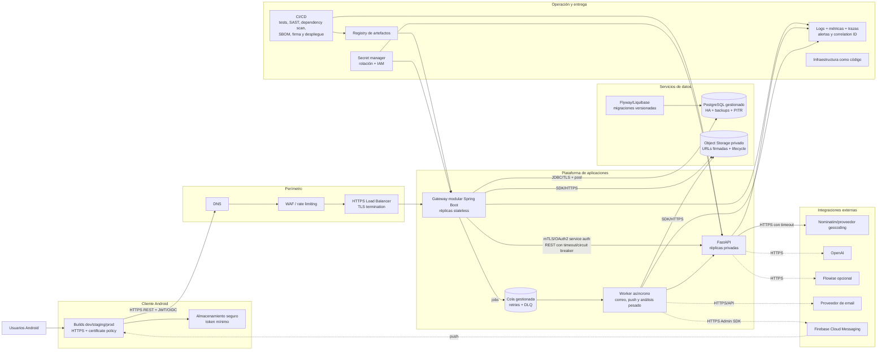

# Arquitectura recomendada — TO-BE

Esta vista es una recomendación para producción; sus componentes no deben confundirse con la implementación actual.

## Diagrama recomendado

## Principios de la transición

1. Mantener Android → gateway → FastAPI. Es un límite claro y no requiere introducir microservicios por módulo.
2. Llevar todas las comunicaciones a HTTPS y hacer privado el acceso a FastAPI y PostgreSQL.
3. Aplicar autorización por recurso en el gateway: propietario, técnico asignado y rol supervisor.
4. Sustituir disco local por object storage privado y URLs firmadas de corta duración.
5. Mantener síncronas las interacciones rápidas del chat; mover correo, push y análisis pesado a una cola con retries y DLQ.
6. Incorporar timeouts, circuit breaker y límites de tamaño en las llamadas externas.
7. Versionar esquema con Flyway/Liquibase y reemplazar `ddl-auto=update` por `validate` en producción.
8. Definir contratos OpenAPI versionados y generar/validar clientes para evitar rutas Android inexistentes.
9. Crear configuraciones dev/staging/prod, retirar URLs hardcodeadas y habilitar logging BODY solo en debug.
10. Centralizar secretos, observabilidad, auditoría y despliegues reproducibles.

## Roadmap recomendado

### Fase 0 — Correcciones antes de exponer el sistema

- Forzar HTTPS y deshabilitar cleartext en release.
- Impedir autoasignación de `SUPERVISOR` durante registro.
- Introducir ownership/ACL en evaluaciones, evidencias, minutas y archivos.
- Proteger `/uploads/**` o reemplazarlo por descarga autenticada.
- Validar tipo, tamaño, categoría y nombre de uploads.
- Desactivar logging BODY en release.

### Fase 1 — Entrega reproducible

- Perfiles por ambiente y base URL mediante BuildConfig.
- Dockerfiles multi-stage para gateway y FastAPI, más entorno local Compose.
- Flyway/Liquibase con esquema inicial versionado.
- Pipeline con unit/integration tests, lint, SAST y escaneo de dependencias.
- Test de contrato Android ↔ gateway ↔ FastAPI.

### Fase 2 — Datos y resiliencia

- PostgreSQL gestionado con backups y restauración probada.
- Object storage privado para evidencias.
- Cliente HTTP con timeouts, pool, retries acotados y circuit breaker.
- Paginación y filtros server-side.
- Idempotencia para uploads, correo y notificaciones.

### Fase 3 — Operación y escala

- Cola/worker para tareas largas.
- Logs JSON con correlation ID, métricas RED y trazas OpenTelemetry.
- Dashboards, alertas y SLOs.
- Autoscaling basado en CPU/latencia/cola.
- Auditoría de acciones sensibles y política de retención de datos.

## Decisiones que no deben asumirse aún

⚠️ No se pudo determinar desde el código qué proveedor cloud, región, presupuesto, volumen de usuarios, RTO/RPO o requisitos regulatorios aplican. Por ello, el diagrama usa capacidades genéricas —base gestionada, object storage, cola, secret manager y plataforma de cómputo— sin inventar AWS, Azure o GCP.

La selección concreta debe documentarse mediante ADRs después de definir restricciones no funcionales y organizacionales.
