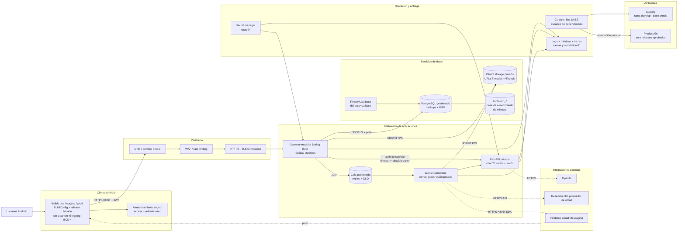

# Arquitectura recomendada — TO-BE

Actualizada al 6 de octubre de 2026. Esta vista es una recomendación: sus componentes no deben confundirse con la implementación actual (ver [AS-IS](architecture-as-is.md)). Hoy el sistema ya corre en Railway; el siguiente paso de mayor valor es **separar staging de producción** para que un push no publique cambios sin probar.

## Diagrama recomendado

```mermaid
flowchart LR
    USER[Usuarios Android]

    subgraph EDGE[Perímetro]
        DNS[DNS / dominio propio]
        WAF[WAF / rate limiting]
        LB[HTTPS · TLS termination]
        DNS --> WAF --> LB
    end

    subgraph APP[Cliente Android]
        APK[Builds dev / staging / prod<br/>BuildConfig + release firmado<br/>sin cleartext ni logging BODY]
        SECSTORE[Almacenamiento seguro<br/>access + refresh token]
        APK --> SECSTORE
    end

    subgraph ENVS[Ambientes]
        STG[Staging<br/>rama develop · base propia]
        PRD[Producción<br/>solo releases aprobados]
    end

    subgraph PLATFORM[Plataforma de aplicaciones]
        API[Gateway modular Spring Boot<br/>réplicas stateless]
        WORKER[Worker asíncrono<br/>correo, push, visión pesada]
        PY[FastAPI privado<br/>chat 76 nodos + visión]
        QUEUE[(Cola gestionada<br/>retries + DLQ)]
        API -->|auth de servicio<br/>timeout + circuit breaker| PY
        API -->|jobs| QUEUE --> WORKER
        WORKER --> PY
    end

    subgraph DATA[Servicios de datos]
        PG[(PostgreSQL gestionado<br/>backups + PITR)]
        OBJ[(Object storage privado<br/>URLs firmadas + lifecycle)]
        MIG[Flyway/Liquibase<br/>ddl-auto=validate]
        KB[(Tablas kb_*<br/>base de conocimiento<br/>de minutas)]
        API -->|JDBC/TLS + pool| PG
        API -->|SDK/HTTPS| OBJ
        WORKER -->|SDK/HTTPS| OBJ
        MIG --> PG
        PG --- KB
    end

    subgraph EXT[Integraciones externas]
        OAI[OpenAI]
        MAIL[Resend u otro proveedor de email]
        FCM[Firebase Cloud Messaging]
    end

    subgraph OPS[Operación y entrega]
        CICD[CI: tests, lint, SAST,<br/>escaneo de dependencias]
        OBS[Logs + métricas + trazas<br/>alertas y correlation ID]
        SECRETS[Secret manager<br/>rotación]
        CICD -->|aprobación manual| PRD
        CICD --> STG
        SECRETS --> API
        SECRETS --> PY
        API --> OBS
        PY --> OBS
        WORKER --> OBS
    end

    USER --> APK
    APK -->|HTTPS REST + JWT| DNS
    LB --> API
    PY -.->|HTTPS| OAI
    WORKER -.->|HTTPS/API| MAIL
    WORKER -.->|HTTPS Admin SDK| FCM
    FCM -.->|push| APK
```

## Principios de la transición

1. Mantener Android → gateway → FastAPI. Es un límite claro y no requiere microservicios por módulo.
2. **Separar ambientes:** staging con su propia base y su rama. Producción solo recibe releases aprobados, con pruebas verdes.
3. Hacer privado el acceso a FastAPI y PostgreSQL; autenticar al gateway ante FastAPI.
4. Aplicar autorización por recurso en el gateway: dueño de la evaluación, técnico asignado y rol Supervisor.
5. Sustituir el disco del servicio por object storage privado con URLs firmadas de corta duración.
6. Mantener síncronas las interacciones rápidas del chat; mover correo, push y análisis pesado a una cola con retries y DLQ.
7. Incorporar timeouts, circuit breaker y límites de tamaño en las llamadas a FastAPI y OpenAI.
8. Versionar el esquema con Flyway/Liquibase y pasar a `ddl-auto=validate` en producción. Las tablas `kb_*` deben entrar así, no por `update`.
9. Definir contratos OpenAPI versionados y generar o validar los clientes.
10. Crear builds dev/staging/prod con `BuildConfig`, firmar el release y habilitar logging BODY solo en debug.
11. Centralizar secretos, observabilidad, auditoría y despliegues reproducibles.
12. Las recomendaciones se alimentan de la base de conocimiento (`kb_regla_recomendacion` + minutas reales), con el motor de reglas actual como respaldo.

## Roadmap recomendado

### Fase 0 — Antes de seguir creciendo en producción

- ✅ HTTPS en producción (Railway).
- ✅ Impedir la autoasignación de `SUPERVISOR` en el registro.
- ✅ Refresh token con rotación y logout.
- Crear **staging** y proteger `main` (PR obligatorio + aprobación).
- Introducir dueño/ACL en evaluaciones, evidencias, minutas y archivos.
- Proteger `/uploads/**` con descarga autenticada.
- Confirmar o crear un volumen persistente para `uploads/` en Railway.
- Validar tipo real, tamaño y nombre de los uploads.
- Desactivar logging BODY y cleartext en release.
- Guardar el código de recuperación hasheado y con contador de intentos.

### Fase 1 — Entrega reproducible

- Perfiles por ambiente y `BASE_URL` por `BuildConfig`.
- ✅ Dockerfiles por servicio y compose para local.
- Flyway/Liquibase con el esquema inicial versionado (incluye las tablas `kb_*`).
- Pipeline con tests unitarios y de integración, lint, SAST y escaneo de dependencias **antes** del deploy.
- Test de contrato Android ↔ gateway ↔ FastAPI (el chat de 76 nodos ya rompió compatibilidad una vez).

### Fase 2 — Datos y resiliencia

- PostgreSQL gestionado con backups y restauración probada.
- Object storage privado para evidencias.
- Cliente HTTP con timeouts, pool, retries acotados y circuit breaker.
- Paginación y filtros del lado del servidor.
- Idempotencia en uploads, correo y notificaciones.
- Base de conocimiento: importador del Excel de minutas y recomendaciones basadas en reglas con frecuencia real.

### Fase 3 — Operación y escala

- Cola y worker para tareas largas (visión, PDF, correo).
- Logs JSON con correlation ID, métricas RED y trazas OpenTelemetry.
- Dashboards, alertas y SLOs.
- Autoscaling basado en CPU, latencia o cola.
- Auditoría de acciones sensibles y política de retención de datos (fotos de locales de clientes).

## Decisiones que no deben asumirse aún

⚠️ El código no permite determinar el plan de Railway ni sus límites, la región, el presupuesto, el volumen de usuarios, el RTO/RPO ni los requisitos regulatorios. Por eso el diagrama usa capacidades genéricas (base gestionada, object storage, cola, secret manager). Seguir en Railway o migrar a otro proveedor debe decidirse con ADRs, después de definir esas restricciones.
