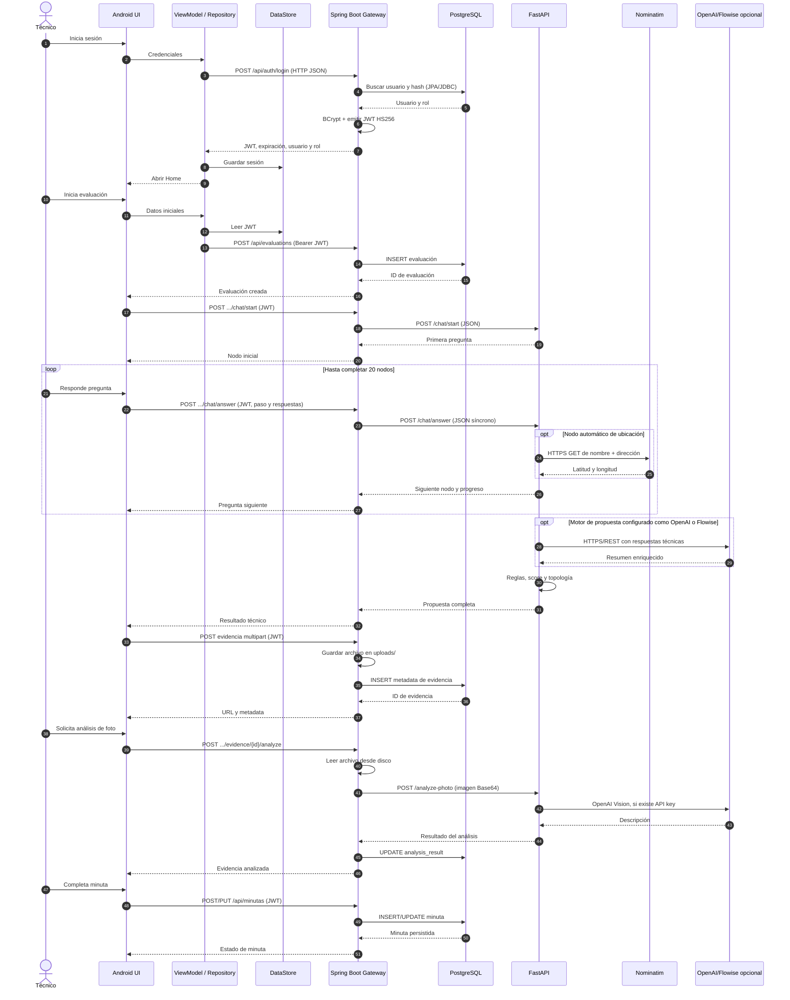
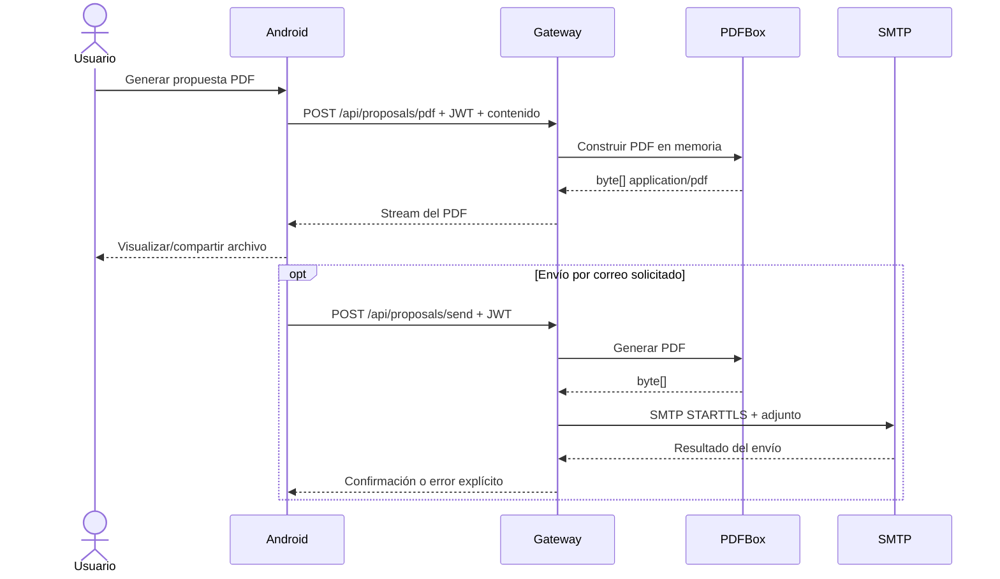
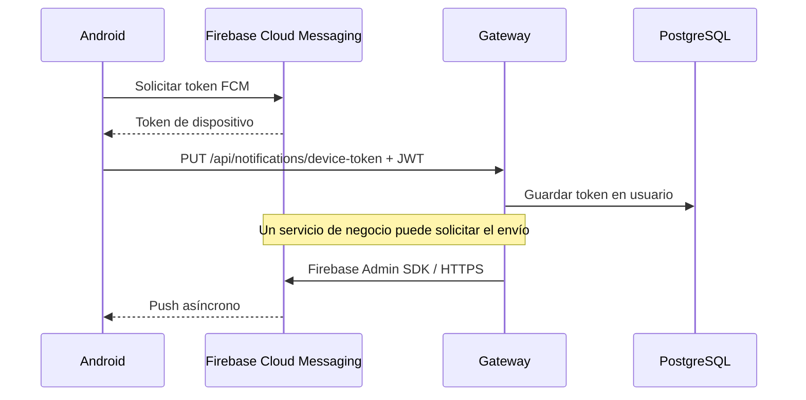

# Flujo de datos

## Diagrama 3 — Flujo principal: evaluación técnica completa

## Explicación paso a paso

1. Android recoge las credenciales y las envía como JSON al gateway.
2. El gateway normaliza el correo, verifica el hash BCrypt y genera un JWT HS256 que contiene identidad y rol.
3. Android guarda JWT, expiración, ID, nombre y rol en DataStore Preferences. El interceptor OkHttp agrega el token a llamadas posteriores.
4. Al crear una evaluación, el gateway valida el JWT y persiste el registro mediante JPA/Hibernate.
5. Para el chat, el gateway actúa como proxy síncrono. Envía a FastAPI el identificador, el paso actual y el mapa acumulado de respuestas.
6. FastAPI conserva el estado del chat en el payload recibido; no se identificó persistencia propia ni sesión server-side del chat.
7. En el nodo automático de ubicación, FastAPI consulta Nominatim y añade coordenadas al mapa de respuestas.
8. Al concluir los 20 nodos, FastAPI calcula reglas, score, equipos, recomendaciones y topología. Puede reemplazar únicamente el resumen mediante OpenAI o Flowise y vuelve a reglas si la integración falla.
9. El gateway devuelve el resultado a Android. En el flujo revisado, no se observó que `ChatService` persista por sí mismo todas las respuestas o la propuesta; la minuta posterior almacena resumen/contenido/topología como texto JSON.
10. Las fotografías se envían como `multipart/form-data` al gateway. El binario va a disco local y sus metadatos a PostgreSQL.
11. Para analizar una imagen, el gateway lee el archivo, lo codifica en Base64 y lo envía síncronamente a FastAPI; FastAPI usa OpenAI si existe una clave.
12. La minuta se crea y actualiza en PostgreSQL. La validación está protegida por rol `SUPERVISOR`.

## Flujo de PDF y correo

El contenido del PDF llega desde Android en el request; el controlador de PDF no consulta directamente PostgreSQL en la implementación observada.

## Flujo de notificaciones

No se identificó una cola: el envío desde el gateway hacia Firebase es directo.

## Sincronía y persistencia

| Flujo | Tipo | Persistencia |
|---|---|---|
| Android → Gateway | Síncrono HTTP REST | DataStore solo guarda sesión local |
| Gateway → FastAPI | Síncrono HTTP REST | FastAPI no persiste en el flujo activo |
| Gateway → PostgreSQL | Síncrono transaccional vía JPA | Persistencia permanente |
| Gateway → disco | Síncrono Java NIO | Archivo permanente solo en el host actual |
| FastAPI → Nominatim/OpenAI/Flowise | Síncrono HTTP(S) | No identificada |
| Gateway → SMTP | Síncrono durante la petición | No identificada |
| Gateway → FCM | Solicitud síncrona; entrega push asíncrona | Token en usuario |

