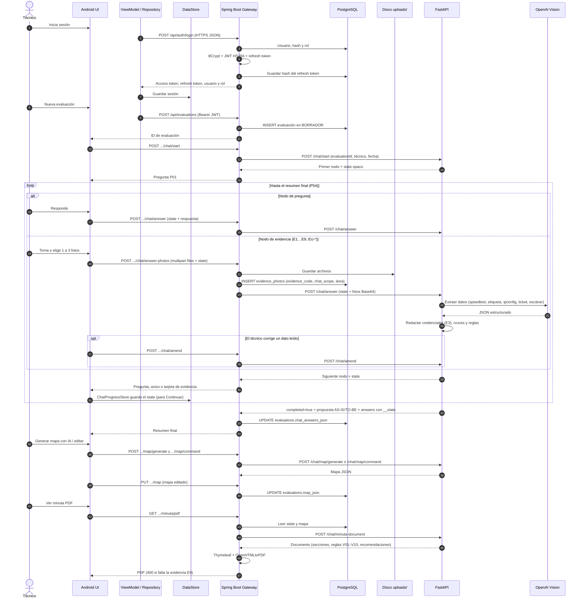
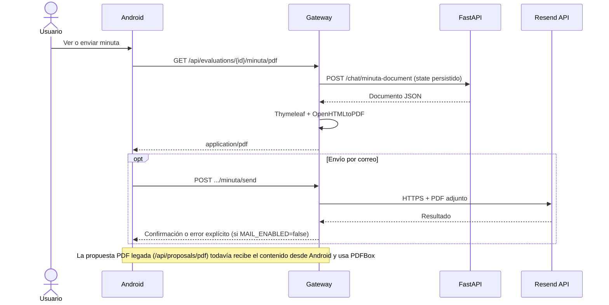
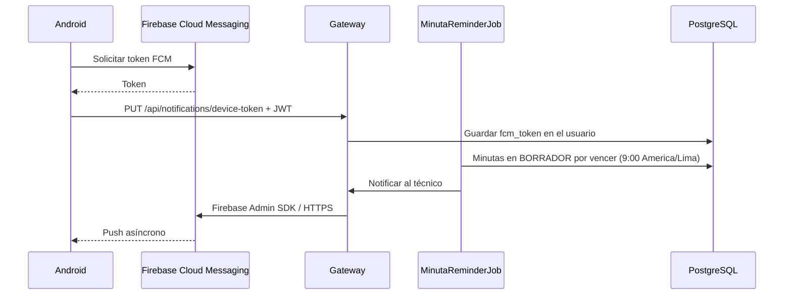

# Flujo de datos

Actualizado al 6 de octubre de 2026: chat de 76 nodos, evidencias en el chat y minuta PDF armada en el servidor.

## Diagrama 3 — Flujo principal: evaluación técnica completa

```mermaid
sequenceDiagram
    autonumber
    actor U as Técnico
    participant UI as Android UI
    participant VM as ViewModel / Repository
    participant DS as DataStore
    participant GW as Spring Boot Gateway
    participant DB as PostgreSQL
    participant FS as Disco uploads/
    participant PY as FastAPI
    participant AI as OpenAI Vision

    U->>UI: Inicia sesión
    VM->>GW: POST /api/auth/login (HTTPS JSON)
    GW->>DB: Usuario, hash y rol
    GW->>GW: BCrypt + JWT HS256 + refresh token
    GW->>DB: Guardar hash del refresh token
    GW-->>VM: Access token, refresh token, usuario y rol
    VM->>DS: Guardar sesión

    U->>UI: Nueva evaluación
    VM->>GW: POST /api/evaluations (Bearer JWT)
    GW->>DB: INSERT evaluación en BORRADOR
    GW-->>UI: ID de evaluación

    UI->>GW: POST .../chat/start
    GW->>PY: POST /chat/start (evaluationId, técnico, fecha)
    PY-->>GW: Primer nodo + state opaco
    GW-->>UI: Pregunta P01

    loop Hasta el resumen final (P54)
        alt Nodo de pregunta
            U->>UI: Responde
            UI->>GW: POST .../chat/answer (state + respuesta)
            GW->>PY: POST /chat/answer
        else Nodo de evidencia (E1…E9, EU-*)
            U->>UI: Toma o elige 1 a 3 fotos
            UI->>GW: POST .../chat/answer-photos (multipart files + state)
            GW->>FS: Guardar archivos
            GW->>DB: INSERT evidence_photos (evidence_code, chat_scope, área)
            GW->>PY: POST /chat/answer (state + fotos Base64)
            PY->>AI: Extraer datos (speedtest, etiqueta, ipconfig, ticket, escáner)
            AI-->>PY: JSON estructurado
            PY->>PY: Redactar credenciales (E3), cruces y reglas
            opt El técnico corrige un dato leído
                UI->>GW: POST .../chat/amend
                GW->>PY: POST /chat/amend
            end
        end
        PY-->>GW: Siguiente nodo + state
        GW-->>UI: Pregunta, aviso o tarjeta de evidencia
        UI->>DS: ChatProgressStore guarda el state (para Continuar)
    end

    PY-->>GW: completed=true + propuesta AS-IS/TO-BE + answers con __state
    GW->>DB: UPDATE evaluations.chat_answers_json
    GW-->>UI: Resumen final

    U->>UI: Generar mapa con IA / editar
    UI->>GW: POST .../map/generate y .../map/command
    GW->>PY: POST /chat/map/generate o /chat/map/command
    PY-->>GW: Mapa JSON
    UI->>GW: PUT .../map (mapa editado)
    GW->>DB: UPDATE evaluations.map_json

    U->>UI: Ver minuta PDF
    UI->>GW: GET .../minuta/pdf
    GW->>DB: Leer state y mapa
    GW->>PY: POST /chat/minuta-document
    PY-->>GW: Documento (secciones, reglas V01–V10, recomendaciones)
    GW->>GW: Thymeleaf + OpenHTMLtoPDF
    GW-->>UI: PDF (400 si falta la evidencia E9)
```

## Explicación paso a paso

1. **Login.** Android envía las credenciales al gateway. El gateway verifica el hash BCrypt, emite un JWT HS256 y un refresh token (guarda solo su hash). `TokenAuthenticator` renueva el access token con `/api/auth/refresh`, y el refresh token se rota en cada uso.
2. **Nueva evaluación.** Toda evaluación nueva nace en **BORRADOR**. Las minutas en borrador vencen a los 30 días (`DRAFT_TTL_DAYS`), y `MinutaReminderJob` avisa al técnico 2 días antes (`DRAFT_WARN_DAYS_BEFORE`).
3. **Chat.** El gateway es un proxy síncrono hacia FastAPI.
   - FastAPI **no guarda estado**: cada respuesta devuelve un `state` opaco que el cliente reenvía.
   - Las respuestas tienen alcance, por ejemplo `P22#L_CAJAS:1`.
   - El gateway prellena P06 (fecha) y P07 (técnico).
4. **Evidencias.** Las fotos llegan en multipart al gateway. El gateway guarda el binario en disco y los metadatos en `evidence_photos`, y las reenvía en Base64 a FastAPI.
   - FastAPI extrae los datos con OpenAI Vision, oculta las credenciales de la etiqueta del router (E3) y cruza la información (proveedor, MAC de la impresora, adaptador).
   - El técnico confirma lo leído o lo corrige (`/amend`).
5. **Fin del chat.** FastAPI devuelve la propuesta AS-IS/TO-BE y el estado completo en `answers["__state"]`. El gateway lo guarda en `evaluations.chat_answers_json`, que es la fuente para el análisis, la minuta y el mapa.
6. **Mapa.** Se genera desde el `state` y se edita en la app (`MapCanvasView`). La versión editada se guarda en `evaluations.map_json`.
7. **Minuta PDF.** **Se arma en el servidor** con datos persistidos, no con contenido enviado por Android: FastAPI produce el documento y el gateway lo convierte en PDF. Sin la evidencia E9 no se genera.
8. **Minutas.** La minuta como registro (borrador, completa, validada) vive en `minutas`. Validar requiere el rol Supervisor.

## Flujo de PDF y correo

```mermaid
sequenceDiagram
    actor U as Usuario
    participant A as Android
    participant G as Gateway
    participant P as FastAPI
    participant R as Resend API

    U->>A: Ver o enviar minuta
    A->>G: GET /api/evaluations/{id}/minuta/pdf
    G->>P: POST /chat/minuta-document (state persistido)
    P-->>G: Documento JSON
    G->>G: Thymeleaf + OpenHTMLtoPDF
    G-->>A: application/pdf

    opt Envío por correo
        A->>G: POST .../minuta/send
        G->>R: HTTPS + PDF adjunto
        R-->>G: Resultado
        G-->>A: Confirmación o error explícito (si MAIL_ENABLED=false)
    end

    Note over A,G: La propuesta PDF legada (/api/proposals/pdf) todavía recibe el contenido desde Android y usa PDFBox
```

## Flujo de notificaciones

```mermaid
sequenceDiagram
    participant A as Android
    participant F as Firebase Cloud Messaging
    participant G as Gateway
    participant J as MinutaReminderJob
    participant DB as PostgreSQL

    A->>F: Solicitar token FCM
    F-->>A: Token
    A->>G: PUT /api/notifications/device-token + JWT
    G->>DB: Guardar fcm_token en el usuario
    J->>DB: Minutas en BORRADOR por vencer (9:00 America/Lima)
    J->>G: Notificar al técnico
    G->>F: Firebase Admin SDK / HTTPS
    F-->>A: Push asíncrono
```

Los push no salen todavía: faltan `google-services.json` en Android y `FIREBASE_CREDENTIALS_JSON` en Railway. No hay cola: el envío a Firebase es directo.

## Sincronía y persistencia

| Flujo | Tipo | Persistencia |
|---|---|---|
| Android → Gateway | Síncrono HTTPS REST | DataStore: sesión y `state` del chat para "Continuar" |
| Gateway → FastAPI | Síncrono HTTP REST, sin timeout configurado | FastAPI no persiste; el estado viaja en `state` |
| Gateway → PostgreSQL | Síncrono transaccional vía JPA | Permanente |
| Gateway → disco | Síncrono Java NIO | Archivo en el disco del servicio. ⚠️ El código no muestra si en Railway hay un volumen persistente |
| FastAPI → OpenAI | Síncrono HTTPS dentro de la respuesta del chat | No persiste en FastAPI; el resultado vuelve en `state` y el gateway lo guarda en `extracted_json` |
| Gateway → Resend | Síncrono durante la petición | No identificada |
| Gateway → FCM | Solicitud síncrona; entrega push asíncrona | Token en el usuario |
| Excel de minutas → tablas `kb_*` | Script local (propuesto) | Solo base local o de pruebas |
