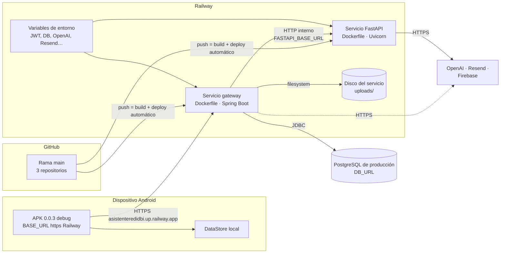
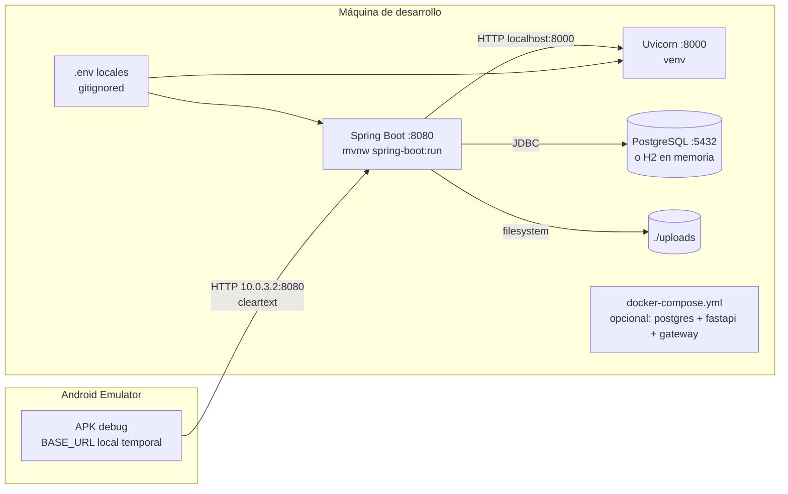

# Arquitectura de despliegue

Actualizada al 6 de octubre de 2026. Hay dos entornos: **producción en Railway** (en uso por el APK 0.0.3) y **desarrollo local**. No existe un ambiente de staging.

## Diagrama 4a — Producción (Railway)

> ⛔ **Push a `main` = despliegue a producción.** No hay pruebas automáticas que lo frenen ni ambiente intermedio. Todo cambio se trabaja en ramas y se prueba en local; solo se mergea a `main` con aprobación del equipo.

## Diagrama 4b — Desarrollo local

## Hallazgos de despliegue

| Elemento | Producción | Local |
|---|---|---|
| Android | APK 0.0.3 debug (sin llave de release); `BASE_URL` HTTPS Railway | Mismo APK, cambiando `BASE_URL` a mano (revertir antes del commit) |
| Gateway | Railway, Dockerfile | `./mvnw spring-boot:run` o compose |
| FastAPI | Railway, Dockerfile | Uvicorn desde `venv` o compose |
| Base de datos | PostgreSQL por `DB_URL`. ⚠️ El código no permite saber si es un plugin de Railway o un servicio externo | PostgreSQL local o H2 (`MODE=PostgreSQL`) |
| Esquema | `ddl-auto=update`: las entidades nuevas crean tablas al desplegar | Igual, o `create-drop` con H2 |
| Evidencias | `UPLOADS_DIR` en el disco del servicio. ⚠️ Sin evidencia en el repo de un volumen persistente: si no hay volumen, las fotos se pierden al redeployar | `./uploads` |
| TLS | Lo pone Railway en el dominio `*.up.railway.app` | No (HTTP local) |
| Docker | ✅ Dockerfile por servicio | `docker-compose.yml` solo para pruebas locales (Railway no lo usa) |
| CI/CD | Build y deploy automático de Railway desde `main`; **sin pruebas automáticas identificadas** | `mvn test`, `pytest` manuales |
| Staging | **No existe** | — |
| Kubernetes / IaC | No identificado | — |
| Backups/DR | No identificado en el repositorio | — |
| Secretos | Variables de Railway | `.env` gitignored |
| Correo | Resend por HTTPS (Railway Hobby bloquea SMTP); apagado mientras `MAIL_ENABLED=false` | Igual |

## Restricciones observadas

- `android:usesCleartextTraffic="true"` sigue activo. Hoy hace falta para probar en local, pero en release debería limitarse con `network_security_config`.
- `/uploads/**` sigue siendo público, tanto en producción como en local.
- Gateway → FastAPI no tiene autenticación de servicio ni timeouts (`RestTemplateConfig` usa `new RestTemplate()`).
- FastAPI acepta CORS `*`, y el gateway usa `*` por defecto si no se define `CORS_ALLOWED_ORIGINS`.
- **Enums en producción.** La base de producción tiene restricciones con los valores de los enums, y `ddl-auto=update` no las migra. Agregar un valor nuevo a un enum da 500; se usa una columna aparte.
- **Contrato del chat.** Cambió con el chat de 76 nodos: un APK anterior no funciona con el backend actual. Backend y APK se despliegan juntos.

## Puertos y rutas

| Proceso | Producción | Local | Consumidor |
|---|---|---|---|
| Gateway | `https://asistenteredidbi.up.railway.app` | `:8080` | Android |
| FastAPI | Interno (`FASTAPI_BASE_URL`) | `:8000` | Gateway |
| PostgreSQL | `DB_URL` | `:5432/asistente_red_idbi` | Gateway |
| Evidencias | `UPLOADS_DIR/evidence/{evaluationId}` + `/uploads/**` público | `./uploads/evidence/{evaluationId}` | Gateway y app |
